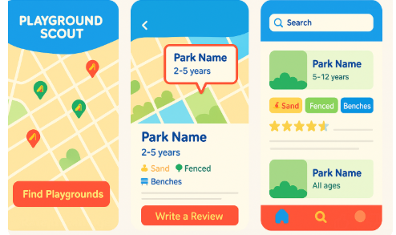

# Playground Scout
*A mobile app that helps parents discover, explore, and share insights about local playgrounds.*

## The Problem
As a parent of two daughters (ages 5 and 2), I understand how important it is to find the *right* playground—one that’s safe for toddlers yet still exciting for older kids. Is there sand, and should we bring sandcastle tools and proper footwear? Is the equipment in good condition? Is there a drinking fountain nearby?

Parents often struggle to find clean, safe, and age-appropriate playgrounds. Tools like Google Maps or city websites might show you where playgrounds are, but they rarely provide the **real-world details** parents actually care about:

- Is it fenced and toddler-friendly?
- What’s the surface type — sand, gravel, rubber?
- Is there shade? Benches? Splash pads?
- Is there a drinking fountain?
- Are there nearby roads, noise, or broken equipment?
- What’s the atmosphere like — quiet or crowded?

Parents need more than a pin on a map. They need trustworthy, community-powered insight.

## The Solution
Playground Scout is a React Native mobile application designed for parents. It combines real-time maps, user-generated content, and community-sourced photos to help users confidently choose the best playgrounds for their children.

### Core Features
🗺️ Interactive Map
- Pins show nearby playgrounds
- Clustering & color-coding for features (e.g., fenced, toddler-safe, splash pad)
- GPS-based "Find Near Me"

🏞️ Playground Detail Pages
Each playground entry includes:
- Name & location with Google Maps directions
- Age range, surface type, fence/shade status
- Seating, splash pads, restrooms, transit/parking
- Proximity to roads/noise level
- Real user photos
- Tags & feature highlights
- Maintenance reports

🔍 Filters & Search
- Radius filtering (e.g., 5km, 10km)
- By age group, splash pad, fencing, surface type
- Accessible features (wheelchair/stroller)

👤 User Accounts
- Sign in with email or Google via Firebase Auth
- User dashboard:
 - Saved favorites
 - Uploaded reviews/photos
 - Basic settings

⭐ Reviews & Comments
- Star ratings + text comments
- Sortable (e.g. most helpful, most recent)
- Tags like “quiet”, “shady”, “great for toddlers”

📸 Photo Uploads
- Upload real images of playgrounds
- Captions and auto-tags
- Optional moderation system

🚧 Issue Reporting
- Report broken equipment or closures
- View maintenance status (manual or future city integration)

## Tech Stack Overview
 ### Frontend:
**Framework**: React Native (via Expo) <br>
**Styling**: NativeWind (Tailwind CSS for React Native)<br>
**Navigation**: react-navigation<br>
**State Management**: Context API or Zustand<br>
**Map Integration**: react-native-maps + Google Maps API<br>
**Image Picker**: Expo ImagePicker or react-native-image-crop-picker

## Backend (Firebase):
**Auth**: Firebase Authentication (email & Google)
**Database**: Firestore
  - Collections:
   - playgrounds
   - reviews
   - users
   - favorites
   - photos
   - reports<br>

**Storage**: Firebase Storage (for images)<br>
**Analytics**: Firebase + Google Analytics

## Working plan:
Start building working application with mock data
Visiting parks personally, Taking detailed photos, Logging features (age range, fencing, surface, etc.), Uploading manually to Firestore via admin UI


At the end - **Playground Scout** isn’t just an app idea — it’s an impactful tool that helps families navigate their communities more safely and joyfully. Whether it stays a side project or grows into something bigger, it’s already a portfolio-defining showcase of your vision and capabilities.

#### Mock Design

___


## Welcome to your Expo app 👋

This is an [Expo](https://expo.dev) project created with [`create-expo-app`](https://www.npmjs.com/package/create-expo-app).

## Get started

1. Install dependencies

   ```bash
   npm install
   ```

2. Start the app

   ```bash
   npx expo start
   ```

In the output, you'll find options to open the app in a

- [development build](https://docs.expo.dev/develop/development-builds/introduction/)
- [Android emulator](https://docs.expo.dev/workflow/android-studio-emulator/)
- [iOS simulator](https://docs.expo.dev/workflow/ios-simulator/)
- [Expo Go](https://expo.dev/go), a limited sandbox for trying out app development with Expo

You can start developing by editing the files inside the **app** directory. This project uses [file-based routing](https://docs.expo.dev/router/introduction).

## Get a fresh project

When you're ready, run:

```bash
npm run reset-project
```

This command will move the starter code to the **app-example** directory and create a blank **app** directory where you can start developing.

## Learn more

To learn more about developing your project with Expo, look at the following resources:

- [Expo documentation](https://docs.expo.dev/): Learn fundamentals, or go into advanced topics with our [guides](https://docs.expo.dev/guides).
- [Learn Expo tutorial](https://docs.expo.dev/tutorial/introduction/): Follow a step-by-step tutorial where you'll create a project that runs on Android, iOS, and the web.

## Join the community

Join our community of developers creating universal apps.

- [Expo on GitHub](https://github.com/expo/expo): View our open source platform and contribute.
- [Discord community](https://chat.expo.dev): Chat with Expo users and ask questions.
